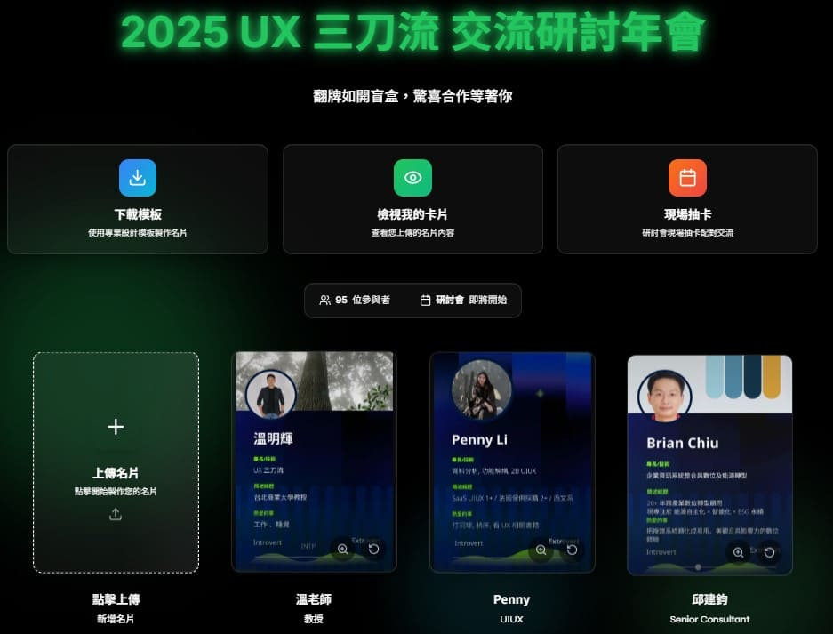

# UX3 三刀流交流研討會 - 互動名片系統



## 🎯 專案概述

這是一個專為研討會設計的互動名片系統，讓參與者可以：

- 下載專業名片模板
- 上傳個人名片
- 提前認識其他參與者
- 現場進行抽卡配對交流

## ✨ 主要功能

### 1. 名片管理

- **下載模板**: 提供專業的 Figma 設計模板
- **上傳名片**: 支持封面和封底圖片上傳（整合 Cloudinary CDN 實現極速圖片載入與最佳化）
- **預覽功能**: 即時預覽上傳的圖片
- **拖拽上傳**: 支持拖拽文件上傳

### 2. 參與者瀏覽

- **卡片展示**: 3D翻轉卡片效果
- **響應式設計**: 適配各種設備尺寸
- **動態動畫**: 流暢的懸停和翻轉效果
- **統計資訊**: 即時顯示參與者數量和狀態（基於 Firebase 即時資料庫）

### 3. 現場抽卡配對

- **隨機抽卡**: 從參與者中隨機抽取
- **配對記錄**: 記錄已抽取的參與者
- **動畫效果**: 抽卡過程的視覺反饋
- **重置功能**: 支持重新開始抽卡

### 4. 管理功能

- **管理員登入**: 安全的後台管理
- **內容管理**: 管理上傳的名片內容
- **數據統計**: 查看系統使用情況

## 🎨 設計特色

### 視覺設計

- **統一設計語言**: 建立一致的品牌色彩和風格
- **玻璃擬態效果**: 現代感的毛玻璃設計
- **漸層色彩**: 科技藍、清新綠、活力橙的主題色彩
- **發光效果**: 動態的光暈和陰影效果

### 動畫效果

- **流暢過渡**: 使用 Framer Motion 實現流暢動畫
- **交錯動畫**: 卡片出現的層次感動畫
- **懸停反饋**: 豐富的互動反饋效果
- **載入動畫**: 科技感的 Matrix 風格載入

### 響應式設計

- **多設備適配**: 支持桌面、平板、手機
- **彈性佈局**: 自適應的網格系統
- **觸控優化**: 移動設備的觸控體驗

## 🚀 技術架構

### 前端技術

- **Next.js 14**: React 全端框架，提供優秀的渲染效能與路由機制
- **TypeScript**: 類型安全的 JavaScript，確保開發與維護穩定性
- **Tailwind CSS**: 實用優先的 CSS 框架，快速構建自定義 UI
- **Framer Motion**: 專業的動畫庫，實現複雜流暢的介面互動

### 雲端與後端服務

- **Firebase**:
  - **即時資料庫 (Firestore/Realtime DB)**: 負責儲存參與者名片資料及抽卡配對狀態，實現多端即時資料同步。
  - **無伺服器架構**: 降低後端維護成本，提供高可用性及擴充性。
- **Cloudinary Image CDN**:
  - **雲端圖片管理**: 專為參與者上傳的「名片圖檔」提供強大的雲端儲存與全球 CDN 節點分發。
  - **動態影像優化**: 支援自動壓縮圖片、轉換現代化格式 (例如 WebP/AVIF) 以及即時裁切，大幅降低前端圖片載入延遲，顯著提升核心網頁指標 (Core Web Vitals) 與用戶體驗。

### 組件架構

- **模組化設計**: 可重用的組件系統
- **狀態管理**: React Hooks 狀態管理
- **API集成**: RESTful API 接口與 Firebase / Cloudinary SDK 整合
- **錯誤處理**: 完善的錯誤處理機制

### 效能優化

- **圖片優化**: 結合 Next.js Image 組件與 Cloudinary Web CDN 達到極致載入速度
- **懶加載**: 按需加載組件和資源
- **動畫優化**: 硬體加速的動畫效果
- **響應式圖片**: 適配不同設備的圖片尺寸

## 📱 使用流程

### 參與者流程

1. **訪問系統**: 進入研討會互動介面
2. **下載模板**: 獲取專業名片設計模板
3. **製作名片**: 使用模板製作個人名片
4. **上傳名片**: 透過 Cloudinary 上傳封面和封底圖片
5. **瀏覽參與者**: 查看其他參與者名片
6. **現場配對**: 參與抽卡配對活動

### 管理員流程

1. **登入系統**: 使用管理員帳號登入
2. **內容審核**: 審核上傳的名片內容
3. **數據管理**: 透過 Firebase 管理參與者數據
4. **活動監控**: 監控系統使用情況

## 🎯 適用場景

- **學術研討會**: 學者間的學術交流
- **商業會議**: 商業夥伴的配對
- **創意工作坊**: 創意人才的合作
- **技術大會**: 技術專家的交流
- **社交活動**: 人際關係的建立

## 🔧 安裝和運行

### 環境要求

- Node.js 18+
- pnpm 或 npm

### 安裝步驟

```bash
# 克隆專案
git clone [repository-url]
cd conference-cards

# 安裝依賴
pnpm install

# 運行開發服務器
pnpm dev

# 構建生產版本
pnpm build
```

### 環境配置

```bash
# 創建環境變數文件
cp .env.example .env.local

# 配置必要的環境變數
DATABASE_URL=your_database_url
NEXTAUTH_SECRET=your_secret_key

# Firebase 配置
NEXT_PUBLIC_FIREBASE_API_KEY=your_firebase_api_key
NEXT_PUBLIC_FIREBASE_PROJECT_ID=your_firebase_project_id
# 依需求補齊其他 Firebase Config...

# Cloudinary 配置
NEXT_PUBLIC_CLOUDINARY_CLOUD_NAME=your_cloudinary_cloud_name
NEXT_PUBLIC_CLOUDINARY_API_KEY=your_cloudinary_api_key
CLOUDINARY_API_SECRET=your_cloudinary_api_secret
```

## �️ 安全性設計與防護 (唯讀展示模式)

本專案目前定位為**作品集靜態展示**，不再對外舉辦實際活動。為兼顧展示體驗與系統安全，特別針對以下面向進行了防禦性設計，以防止雲端資源遭濫用：

1. **強制關閉檔案上傳 API (`/api/upload`)**
   - **挑戰**：即便拔除前端「上傳按鈕」，有心人士仍可透過解析網路請求，直接對後端 API 發送大量的 POST 請求，將第三方空間（Cloudinary）當作免費圖床濫用，造成高額帳單。
   - **解法**：在 API 路由的進入點直接進行短路攔截，無條件回傳 `403 Forbidden`。徹底從伺服器端斷絕未經授權的檔案上傳與資料庫寫入。

2. **管理員後台雙層防護**
   - **挑戰**：前端元件若保留對管理員密碼的驗證邏輯，容易在打包後的程式碼中洩漏明文密碼。
   - **解法**：建立「雙層防護架構」。第一層要求必須擁有特定 Google 帳號的 Auth 授權才能訪問登入頁；第二層輸入密碼後，交由後端 API (`/api/admin/login`) 與環境變數進行比對。
   - **展示環境的安全妥協**：由於專案已轉為唯讀展示，且沒有高度機敏的使用者個資，當下採用了輕量化的 HttpOnly Cookie 作為 Session 驗證。對於生產環境，最佳實踐應改為簽發 JWT Token 或使用更嚴謹的 Session 管理機制。

3. **Firebase 存取限制**
   - **挑戰**：前端應用的 Firebase API Key 具有公開性質，駭客可能直接調用金鑰寫入垃圾資料。
   - **解法**：配合展示需求，透過 Firestore Security Rules 將資料庫權限設定為「僅供讀取或授權寫入」，既能讓來訪的瀏覽者正常查看名片 3D 牆，也確保了資料庫的絕對安全。

## �📊 性能指標

- **載入速度**: 首屏載入 < 2秒
- **動畫幀率**: 60fps 流暢動畫
- **響應時間**: 用戶操作 < 100ms
- **兼容性**: 支持現代瀏覽器

## 🤝 貢獻指南

歡迎提交 Issue 和 Pull Request 來改進這個專案！

### 開發規範

- 使用 TypeScript 編寫代碼
- 遵循 ESLint 規則
- 編寫單元測試
- 保持代碼文檔完整

## 📄 授權協議

本專案採用 MIT 授權協議，詳見 LICENSE 文件。

## 📞 聯繫方式

如有問題或建議，請通過以下方式聯繫：

- 提交 GitHub Issue
- 發送郵件至 [email]
- 加入討論群組 [group-link]

---

**讓每一次研討會都成為改變世界的起點！** 🚀
